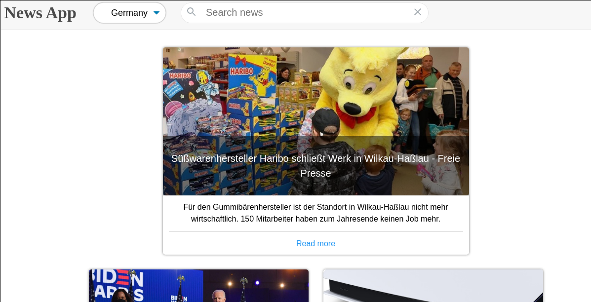

# NewsApi


## About Application
Application render news from __newsapi__. You can choose a news of Germany, Italy and Russian.
Search bar allow you to find specific news.

## List of technologies
- Java Script
- React
- Scss
- Webpack

## For starting use this application you should initialize a project

1. First of all, move to directory where you want to see this repo, with command in a terminal:
```zsh
cd $HOME/path/to/your-folder
```

2. Then in the terminal copy this repo with command:
```zsh
git clone https://github.com/Mirhaydarov/NewsApi.git
```

3. And initial project:
```zsh
cd NewsApi
npm i
```

4. For start app use command:
```zsh
npm run start
```

5. For build project in product mode:
```zsh
npm run build
```
## important!
Application will doesn't work in build mode because cors politics accept to use app only in localhost.

More commands you can find in root project directory in file __package.json__ to section "scripts".